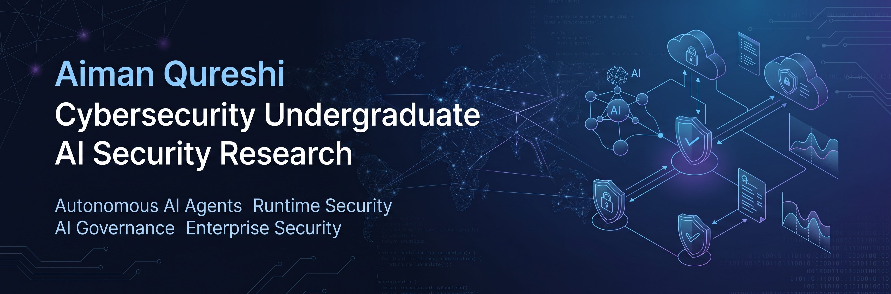
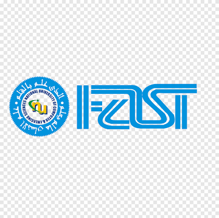

  

<h1 align="center">Aiman Qureshi</h1>

  
  
  
  

  
  &nbsp;&nbsp;Cybersecurity Undergraduate at FAST-NUCES &nbsp;|&nbsp; Building Secure Enterprise AI Systems

  
  
  

 

## About Me

I'm a Cybersecurity undergraduate at **FAST National University of Computer and Emerging Sciences (FAST-NUCES), Pakistan**, with a strong interest in securing the next generation of intelligent systems.

My research focuses on understanding how autonomous AI agents operate, how they interact with tools and external systems, and how they can be monitored, governed, and secured in enterprise environments. I'm particularly interested in bridging cybersecurity and artificial intelligence by developing practical solutions for trustworthy AI deployment.

 

## Research Interests

  
  
  
  

  
  
  
  
  

 

## Current Focus

- Researching AI agent architectures
- Runtime monitoring and behavioral analysis of autonomous agents
- Enterprise AI governance and policy enforcement
- Secure tool calling and execution
- Preparing for graduate research in AI Security

 

## Featured Projects

### PRISM — Prompt & Interaction Security Monitor
*Final Year Project*

An enterprise AI-security platform that monitors employee behavior and cyber hygiene during interactions with generative AI tools, blocking, warning, or redacting prompt content based on data confidentiality. Supports text, image, and PDF-based prompts — including OCR-based detection of sensitive information in images — with per-enterprise configurable policies mapped to industry security standards such as NIST.

  
  
  
  
  
  

### Enterprise Credit Risk Prediction Pipeline

An end-to-end machine learning pipeline for borrower credit risk prediction, built on the Home Credit Default Risk dataset.

  
  
  
  
  
  

### AI Runtime Security Research
*Ongoing, independent research*

Exploring the secure execution of autonomous AI agents.

  
  
  
  
  
  

 

## Technical Skills

**Programming Languages**

  

**AI & Machine Learning**

  

**Development & DevOps**

  

**Cybersecurity & Network Analysis**

  
  
  
  
  
  
  
  

 

## Current Goals

- Publish research in AI Security
- Pursue a Master's degree focused on AI Security
- Build enterprise security solutions for autonomous AI systems
- Contribute to trustworthy AI research

 

## Connect

  
  

 

  <em>"Building trustworthy AI systems through secure design, runtime monitoring, and governance."</em>

